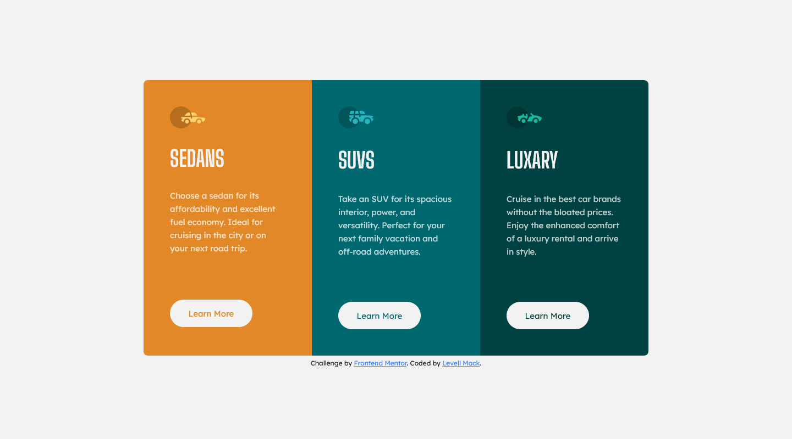
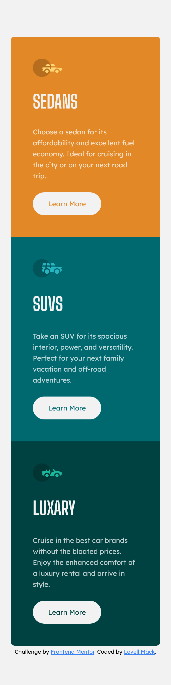

# Frontend Mentor - Product preview card component solution

## Overview

### The challenge

Your challenge is to build out this 3-column preview card component and get it looking as close to the design as possible.

You can use any tools you like to help you complete the challenge. So if you've got something you'd like to practice, feel free to give it a go.

Your users should be able to:

- View the optimal layout depending on their device's screen size
- See hover states for interactive elements

### Screenshots

### Links

- Solution URL: [3 Column Preview Card Component](https://llxovell.github.io/frontend-mentor-challenges/3-column-preview-card-component-main/)

## My process

### Built with

- HTML5
- [TailwindCSS](https://https://tailwindcss.com/) - CSS framework

### What I learned

I learned how to take a screenshot of a full page, at any screen size, on my computer from Firefox's "Responsive Design Mode". In addition, I learned how to change my content in tailwind.config.js to find my index.html in the top level folder, without it having to search every single folder.

### Challenges I faced

Again, getting the exact spacing and font sizes is **Extremely** difficult without the sketch/figma files that I didn't have access to on the free tier. Still satisified with the end product even if it is pixels off in a few places.

### Continued development

I'm unlikely to work on this again in the future.

### Useful resources

- [TailwindCSS](https://tailwindcss.com/docs/) - Always useful to reference the documentation. I almost never need more than this documentation.

## Author

- Website - [Levell Mack](https://llxovell.github.io/) **W.I.P.**
- Frontend Mentor - [@Llxovell](https://www.frontendmentor.io/profile/Llxovell)
