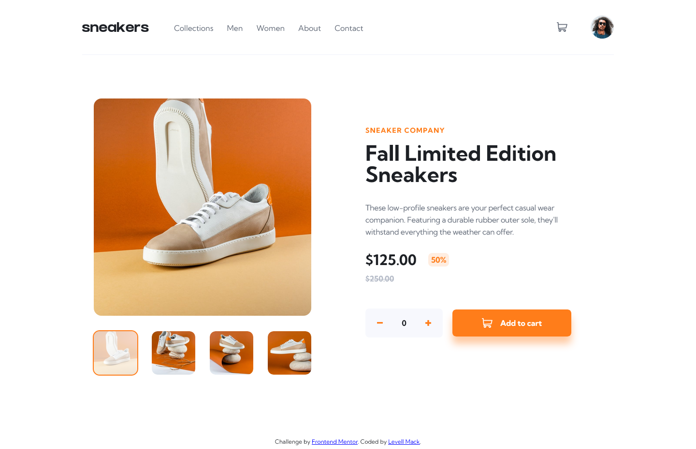

# Frontend Mentor - E-commerce product page

## Overview

### The challenge

Your challenge is to build out this e-commerce product page and get it looking as close to the design as possible.

You can use any tools you like to help you complete the challenge. So if you've got something you'd like to practice, feel free to give it a go.

Your users should be able to:

- View the optimal layout for the site depending on their device's screen size
- See hover states for all interactive elements on the page
- Open a lightbox gallery by clicking on the large product image
- Switch the large product image by clicking on the small thumbnail images
- Add items to the cart
- View the cart and remove items from it

### Screenshots

### Links

- Solution URL: [Ecommerce Product Page](https://llxovell-eccomerce-product-page.netlify.app/)

## My process

### Built with

- [Astro](https://astro.build/) - Web Framework
- [React](https://reactjs.org/) - JS Library
- [Nano Stores](https://github.com/nanostores/nanostores/) - State Manager
- [TailwindCSS](https://https://tailwindcss.com/) - CSS framework

### Useful resources

- [React Documentation](https://beta.reactjs.org/) - Use this documentation over the docs on the react website; it's way better.
- [TailwindCSS Documentation](https://tailwindcss.com/docs/) - Always useful to reference the documentation. I almost never need more than this documentation.

## Author

- Website - [Levell Mack](https://llxovell.github.io/) **W.I.P.**
- Frontend Mentor - [@Llxovell](https://www.frontendmentor.io/profile/Llxovell)

