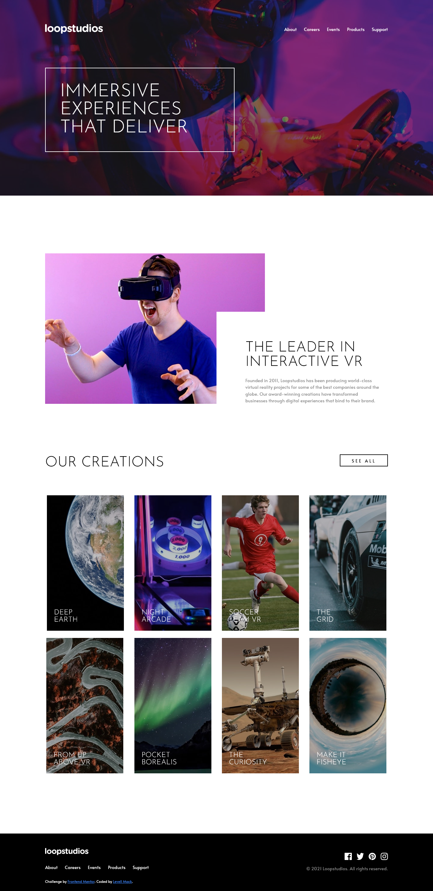
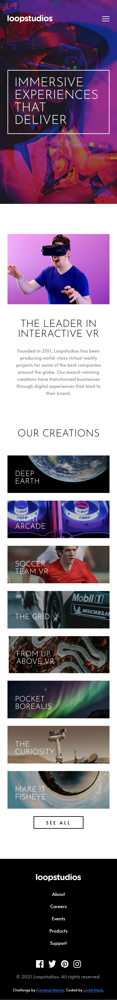

# Frontend Mentor - Product preview card component solution

## Overview

### The challenge

Your challenge is to build out this landing page and get it looking as close to the design as possible.

This challenge focuses mostly on HTML & CSS. There's a tiny bit of JS included for the mobile navigation toggle. But you could also choose to do this without JS!

You can use any tools you like to help you complete the challenge. So if you've got something you'd like to practice, feel free to give it a go.

Your users should be able to:

View the optimal layout for the site depending on their device's screen size
See hover states for all interactive elements on the page

### Screenshots

### Links

- Solution URL: [Loopstudios Landing Page](https://llxovell.github.io/frontend-mentor-challenges/loopstudios-landing-page-main/)

## My process

### Built with

- HTML5
- [TailwindCSS](https://https://tailwindcss.com/) - CSS framework

### Challenges I faced

Again, even more fustrating this time, getting the exact spacing and font sizes is **Extremely** difficult without the sketch/figma files that I didn't have access to on the free tier.

### Continued development

I'll add the mobile menu modal and the js for it soon.

### Useful resources

- [TailwindCSS](https://tailwindcss.com/docs/) - Always useful to reference the documentation. I almost never need more than this documentation.

## Author

- Website - [Levell Mack](https://llxovell.github.io/my-portfolio/) **W.I.P.**
- Frontend Mentor - [@Llxovell](https://www.frontendmentor.io/profile/Llxovell)
