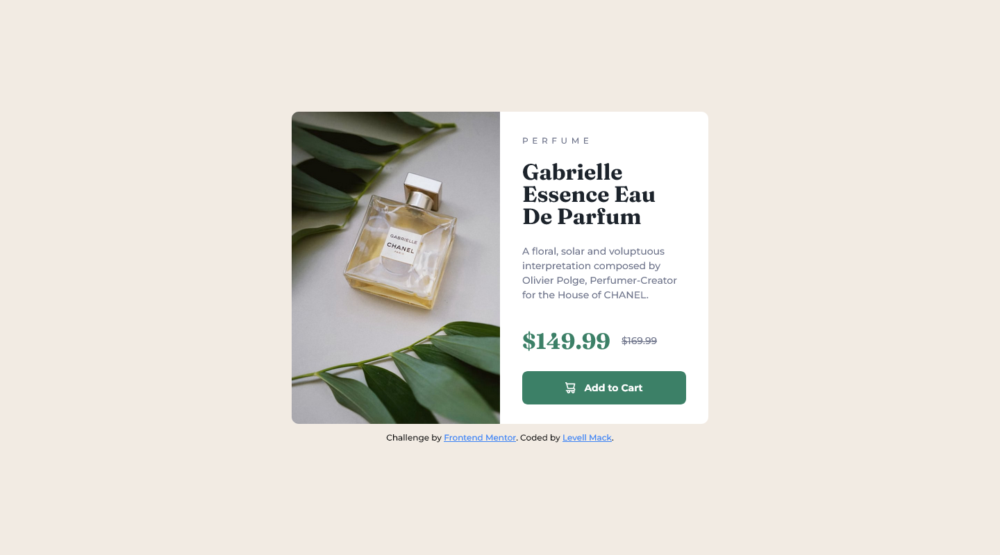
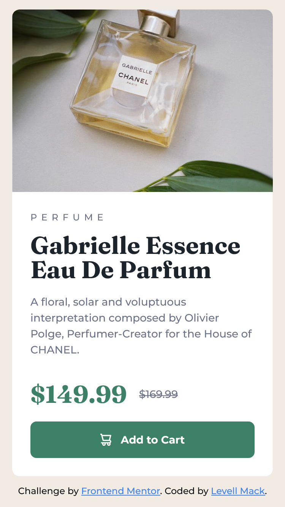

# Frontend Mentor - Product preview card component solution

## Overview

### The challenge

Users should be able to:

- View the optimal layout depending on their device's screen size
- See hover and focus states for interactive elements

### Screenshots

### Links

- Solution URL: [Product Preview Card Component](https://llxovell.github.io/frontend-mentor-challenges/product-preview-card-component-main/home/)

## My process

### Built with

- HTML5
- [TailwindCSS](https://https://tailwindcss.com/) - CSS framework

### What I learned

Firefox has _incredible_ frontend tools. I actually didn't use it until after I finished the challenge, unfortunately. However, I most certainly will again in the future. I didn't learn much more from this project past that, since I'm already very familiar with TailwindCSS, vanilla CSS, and HTML.

### Challenges I faced

Getting the exact spacing and font sizes is **Extremely** difficult without the sketch/figma files that I didn't have access to on the free tier. Still satisified with the end product even if it is pixels off in a few places.

### Continued development

I'm unlikely to work on this again in the future.

### Useful resources

- [TailwindCSS](https://tailwindcss.com/docs/) - Always useful to reference the documentation. I almost never need more than this documentation.

## Author

- Website - [Levell Mack](https://llxovell.github.io/my-portfolio/) **W.I.P.**
- Frontend Mentor - [@Llxovell](https://www.frontendmentor.io/profile/Llxovell)

## Acknowledgments

Thanks to Kevin Powell for reminding me of Frontend Mentor. I'm doing the same challenge from one of his recent videos, **BUT**, I did **NOT** watch his solution, yet. I wanted to find the solution on my own, which i plan to do on all my challenges. I did, however, learn most of my css knowledge from Kevin Powell from the past 2+ years.
